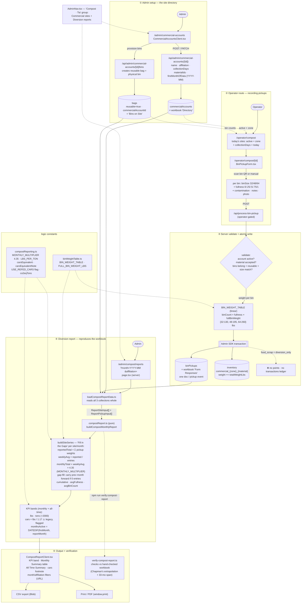

# Tia's Compost Route — End-to-End Flow Graph

> What the app does with the Compost Clubhouse food-scrap collection route that
> Tia (and Dominique) run. Generated 2026-06-15 from the Phase A→C compost code.
> See [Compost Integration - Phase C.md](./Compost%20Integration%20-%20Phase%20C.md).

**Tia** = Tia Johnson, founder of **Compost Clubhouse**, a commercial food-scrap
collection business in Columbus, OH (~19 active sites split across two
affiliations: `compost_clubhouse` private clients and `city_of_columbus` public
drop-offs). **"Tia's compost route"** = the operator's recurring food-scrap
pickup round at those commercial sites (Florin Cafe, The Columbus Foundation,
Overlook Cafe, The Wellington School, …). The app captures each pickup, rolls
weight into diversion inventory, and reproduces Tia's Excel workbook
("Compost Clubhouse Collection Data") as monthly diversion reports —
all in a `/admin/compost/*` + `/operator/compost/*` namespace that never touches
points / transactions (food scrap is `diversion_only` = 0 points).



## Quick legend of the moving parts

| Stage | Where | Workbook analogue |
|-------|-------|-------------------|
| Site directory | `commercialAccounts` + `/admin/commercial-accounts` | **Directory** sheet |
| Bins on site | `bags` where `reusable=true` | "Bins on Site" column |
| Pickup capture | `/operator/compost/[id]` → `/api/process-bin-pickup` → `binPickups` | **Form Responses** sheet |
| Weight model | `binWeightTable.ts` (linear `count × fullness × fullBinWeight`) | **Static Values** |
| Monthly extrapolation | `compostReport.ts` `buildSiteSeries` | **Fill in the Gaps CCH/CoC** |
| Report output | `/admin/compost/reports` + `CompostReportClient` | **Monthly Reports CCH/CoC** |
| Constants | `compostReporting.ts` (4.35×, lbs→tons, cars/1.17) | Static Values + ReFED |

## Key invariants

- **No points.** Food scrap is `payoutMode: 'diversion_only'` — pickups write
  `binPickups` + `inventory` only, never `transactions` or `pointsBalance`.
- **Linear weights** (Phase C decision) so the app reproduces Tia's 3-yr history
  exactly: `weight = binCount × fullnessFraction × {32:130, 48:195, 64:260}`.
- **Monthly total ≠ raw sum.** It's the month's *weekly average × 4.35*, with
  zero-entry months gap-filled by carrying the prior month forward.
- **Cars-equivalent is knowingly wrong** (`lbs / 1.17`) — reproduced for
  continuity with reports clients already received, flagged via `carsNote` and
  togglable with `USE_REFED_CARS`.
- **Walled off** from recycling: `/admin/compost/*` reads only
  `commercialAccounts` + `binPickups` + `bags`; admin-gated by `src/proxy.ts`.
```
